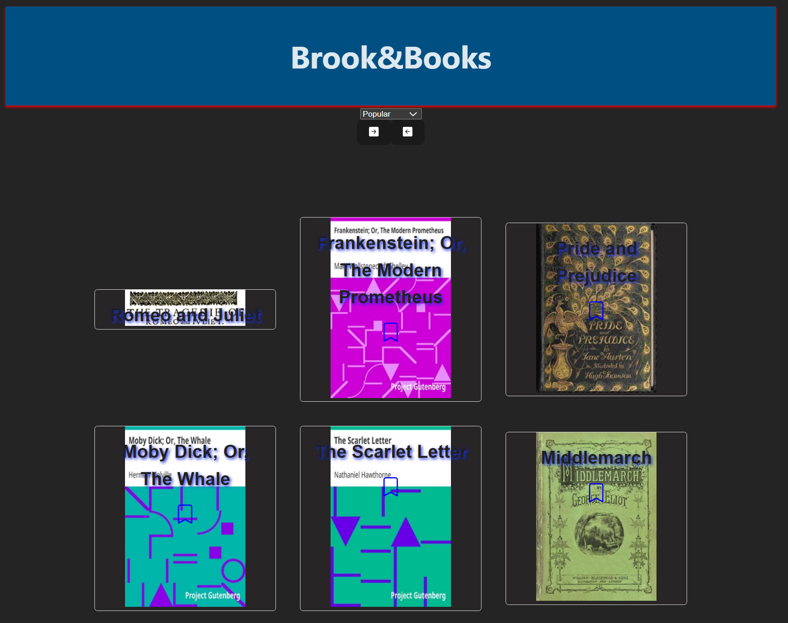

# Brooks&Books - Your Bookworm's Companion

> Brooks&Books is your ultimate book discovery and management tool, allowing you to explore a vast library of popular books and keep your reading life organized.

## General Info

Brooks&Books is your go-to app for exploring a wide array of popular books. With Brooks&Books, you can seamlessly manage your reading list, organizing books as "To Read" or "Already Read," and sort them by popularity, ascending or descending order. The app boasts a user-friendly interface, enriched with vibrant colors, book covers, titles, and a virtual "bookshelf" for storing your literary treasures.

## Features

### Book Discovery

- **Vast Library**: Access a vast collection of books, organized by popularity.
- **Sort and Filter**: Easily sort books by popularity, ascending or descending order.
- **Stylish UI**: Enjoy a visually pleasing and colorful user interface.

### Book Management

- **Organize**: Categorize books as "To Read" or "Already Read" to keep your reading list in order.
- **Cover Gallery**: View book covers to visually identify your favorites.
- **Detailed Book Sheets**: Store comprehensive information about each book.

### Navigation

- **Page Navigation**: Convenient buttons for easy page navigation.

## Status

Project is: **Ongoing**

---

**Team Members**:

- Juan

Feel free to reach out to us for any inquiries or feedback. Brooks&Books is designed to make your reading experience enjoyable and organized. Happy reading!
